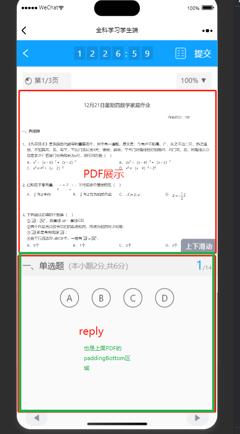

---

title: 教学资料做题模块

date: 2024-01-24 11:11:05

tags:
- 模块
- 教学资料答题
- hammerjs库
- 页面拖动自适应
- 递归组件
---

## 模块总览

<style>
.two-finger{
  max-width:400px;
  display: flex;
  justify-content: center;
}
</style>

<div class='two-finger'>

</div>

# 特点介绍

## 1、页面拖动自适应



```tsx
//变量定义
  const [replyHeight, setReplyHeight] = useState<{
    height: number;
    y: number;
  }>({
    height: 0,
    y: 0,
  }); //用于记录答题区域被拖动的开始数据,height为高度，y为纵坐标
```

```tsx
 <div
          className={styles.slide}
          onTouchStart={(e) => {
            //获取手指按下去的位置信息，touch.clientY点击位置的y坐标，content.clientHeight元素的高度（不含有边框，边距，滚动条）
            const touch = e.touches[0];
            const content = document.querySelector('.scantronReply') as Element;
            setReplyHeight({
              height: content.clientHeight,
              y: touch.clientY,
            });
          }}
          onTouchMove={(e) => {
            const y = e.touches[0].clientY;
            const content = document.querySelector('.scantronReply') as HTMLDivElement; //整个作答区域
            const contentItems = document.querySelectorAll(
              '.contentItem',
            ) as NodeListOf<HTMLDivElement>; //每个作答
            const contentPDF = document.querySelector('.contentPDF') as HTMLDivElement; //PDF试卷展示区域

            if (y < replyHeight?.y) {
              //滑动位置y轴小于初始位置，说明此分支触摸点是向上滑动的
              content.style.height = (replyHeight.y - y) + replyHeight.height + 'px'; //滑动距离加初始元素高度
              contentItems.forEach((item: HTMLDivElement) => {
                item.style.height = replyHeight.y - y + replyHeight.height - 80 + 'px';  //里面的每个小作答，-80是因为标题大概80px
              });
              contentPDF.style.paddingBottom = replyHeight.y - y + replyHeight.height + 'px';  //PDF展示区域是大约整个页面，用paddingBottom给可视区域挤上去
            } else {
               //此分支触摸点是向下滑动
              content.style.height = replyHeight.height - (y - replyHeight.y) + 'px';  //初始高度减向下滑动的距离，下方类似
              contentItems.forEach((item: HTMLDivElement) => {
                item.style.height = replyHeight.height - (y - replyHeight.y) - 80 + 'px';
              });
              contentPDF.style.paddingBottom = replyHeight.height - (y - replyHeight.y) + 'px';
            }
          }}
        >
        上下滑动
        </div>
```
  此功能可使作答区域和PDF展示区域不互相遮挡，无论如何拖动只要PDF区域设置overflow：auto，通过滑动都可全部展示

## 2、PDF可自由缩放

因需二指缩放，故用了hammerjs第三方库

<style>
.two-finger{
  max-width:400px;
  display: flex;
  justify-content: center;
}
</style>

<div class='two-finger'>

</div>

```tsx
<div className={`${styles.contentPDF} contentPDF`}>
        {previewUrl && (
          <PDF
            file={previewUrl}
            onDocumentComplete={(pages: number) => setPageNums(pages)}
            page={currentPage}
          />
        )}
        <div />
      </div>
```

HTML区域，PDF组件用的react-pdf库，主要是className=‘contentPDF’；

```tsx
useEffect(() => {
    if (!pageNums) return;  //PDF的页数，PDF没加载前不监听
    const contentPDF = document.querySelector('.contentPDF') as HTMLDivElement;  
    if (contentPDF) {
      const canvas = contentPDF.querySelector('canvas');
      if (canvas) {
        canvas.style.width = '100%';  //因为第一次加载时，PDF画在canvas上是初始尺寸，宽度设100%以适应父元素的大小，高度就自适应了
        //试卷二指缩放事件监听
        const mc = new Manager(canvas, {
          touchAction: 'auto',
        });  //创建一个总控制，第二个参数是控制元素的css一些属性，会默认设置touchAction：none,这样会禁止元素的单指滑动事件
        const PinchEle = new Pinch();  //初始一个二指滑动事件
        mc.add(PinchEle); //添加滑动监听
        mc.on('pinchstart', (e) => {
          e.preventDefault();
          canvas.style.touchAction = 'none';
        });//开始二指滑动，禁止单指滑动事件
        mc.on('pinchend', (e) => {
          e.preventDefault();
          canvas.style.touchAction = 'auto';
          scaleRef.current = Math.round(scaleRef.current + (e.scale - 1) * 100);  //记录结束后缩放的比例用的100%:100
        });//结束时，给单指滑动事件解禁
        mc.on('pinchmove', (e) => {
          e.preventDefault();
          if (scaleRef.current + (e.scale - 1) * 100 < 100) {
            e.target.style.width = '100%';  //不允许将元素缩到100%以下
          } else {
            e.target.style.width = `${scaleRef.current + (e.scale - 1) * 100}%`;  // 之前缩放的比例，加当前的缩放比例，开始时e.scale为1，要减去
          }
        });

        // 监听元素;

        const resizeObserver = new ResizeObserver((entries) => {
          entries.forEach((entry) => {
            const targetWidth = entry.contentRect.width;
            const parentWidth = (entry.target.parentNode as HTMLDivElement).clientWidth;
            const widthPercentage = targetWidth / parentWidth;
            setScalePDF(Math.round(widthPercentage * 100));  //监听元素缩放的情况，setScalePDF是为了在页面展示当前缩放的程度
          });
        });

        resizeObserver.observe(canvas as HTMLElement);
      }
    }
  }, [pageNums])
```
原理是固定外面元素contentPDF的宽高，设置overflow：auto，然后对内部的canvas进行宽度的缩放(高度会自适应)，在二指缩放期间禁止单指缩放，结束后解禁
实现PDF的单指滚动效果

## 3、题目组件递归

普通题目为单/多选，判断，填空，简答，作文。特殊题为组合题（可能包含所有种类普通题）

```tsx
//更行数据的函数为，answerChange
switch (type) {
    case 'SingleChoice':
      template = (
        <MobileSingleChoice
          workState={workState}
          question={ques as SingleChoiceBodyProps}
          answerChange={answerChange}
        >
          {modelAnswerTitle}
        </MobileSingleChoice>
      );
      break;
    case 'MultiChoice':
      template = (
        <MobileMultiChoice
          workState={workState}
          question={ques as MultiChoiceBodyProps}
          answerChange={answerChange}
        >
          {modelAnswerTitle}
        </MobileMultiChoice>
      );
      break;
    case 'Judgment':
      template = (
        <MobileJudgment
          workState={workState}
          question={ques as JudgmentBodyProps}
          answerChange={answerChange}
        >
          {modelAnswerTitle}
        </MobileJudgment>
      );
      break;
    case 'MultiBlanks':
      template = (
        <MobileMultiBlanks
          workState={workState}
          uploader={uploader}
          question={ques as MultiBlanksBodyProps}
          answerChange={answerChange}
        >
          {modelAnswerTitle}
        </MobileMultiBlanks>
      );
      break;
    case 'SingleBlank':
      template = (
        <MobileSingleBlank
          workState={workState}
          question={ques as SingleBlankBodyProps}
          answerChange={answerChange}
          uploader={uploader}
          inCombination={inCombination}
          setCurCursor={setCurCursor}
        >
          {modelAnswerTitle}
        </MobileSingleBlank>
      );
      break;
    case 'Composition':
      template = (
        <MobileSingleBlank
          workState={workState}
          type="Composition"
          question={ques as SingleBlankBodyProps}
          answerChange={answerChange}
          uploader={uploader}
          inCombination={inCombination}
          setCurCursor={setCurCursor}
        >
          {modelAnswerTitle}
        </MobileSingleBlank>
      );
      break;
    case 'Combination':
      template = (
        <MobileCombination
          workState={workState}
          question={ques}
          uploader={uploader}
          answerChange={answerChange}
          setCurCursor={setCurCursor}
        />
      );
      break;
    default:
      break;
  }
```

1、适配器，适配所有的题目包括组合题

```tsx
<div>
      {question.littleQuestion.map((item: QuestionProp, i: number) => (
        <div key={item.order} style={{ marginTop: '0.55rem' }}>
          <div className={styles.smallTitle}>
            （{item.order}） {item.type === 'MultiChoice' && <span>多选</span>}
          </div>
          <MaterialReply
            setCurCursor={setCurCursor}
            workState={workState}
            uploader={uploader}
            type={item.type as string}
            ques={item}
            answerChange={(value: QuestionProp) => {
              question.littleQuestion[i] = value;
              answerChange(question);
            }}
            inCombination={true}
          />
        </div>
      ))}
    </div>
```

2、组合题的渲染，因为组合题都是其他题目组成的，所以map循环渲染组合题。然后重写answerChange函数，因为传入的question是对象中的数据，修改这个数据，原来对象数组也会被修改，所以直接找到题目数组里当前数组的题目修改他的作答，然后调用当前组件里传入的answerChange(question);，这样就可以无限循环下去。

**遇到组合题的循环逻辑是1->2->1->2->1............**

