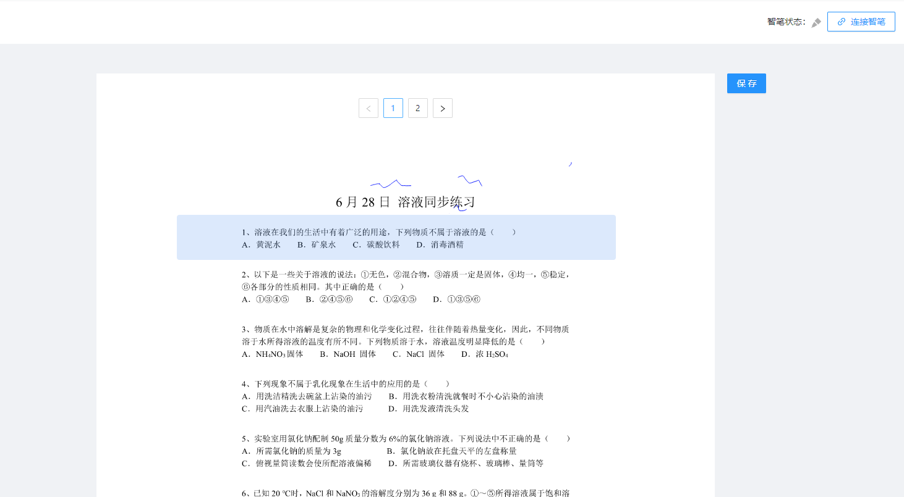
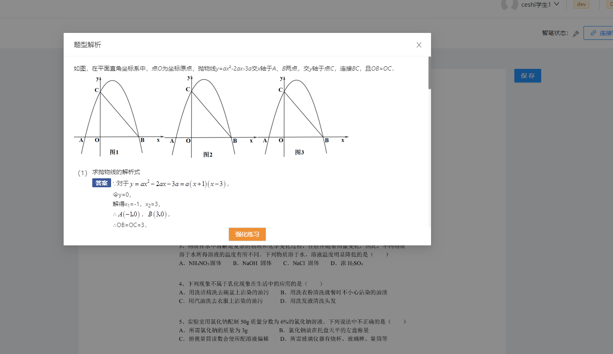

---

title: 智笔习题册

date: 2024-01-24 16:13:12

tags:
- 点阵笔
- 真实笔迹记录
---

# 点阵笔做题






```tsx
 import React, { useEffect, useState } from 'react';
import { PageContainer } from '@ant-design/pro-layout';
import pen_connect from '@/assets/pen_connect.png';
import pen_disconnect from '@/assets/pen_disconnect.png';
import styles from './index.less';
import { Button, Modal, Pagination, message } from 'antd';
import { DisconnectOutlined, LinkOutlined } from '@ant-design/icons';
import request from 'umi-request';
import useTinsoPen from '@/utils/hooks/useTinsoPen/useTinsoPen';
import { data } from './data';
import { getOnceQuestion } from '../services/homework';
import { QuestionView } from 'tinso-question-mini';
import { getOneExerciseDetail, getOrCreateReply, getUpdateReply } from '../services/homework';
import { useParams } from 'umi';
import { getOssConfig } from '@/services/file';
import { readFile } from '@/services/file';
type Data = typeof data;
const ExerciseBook = () => {
  const { id }: { id: string } = useParams();
  const [battery, setBattery] = useState(0);
  const [visible, setVisible] = useState(false);
  const [curPagePt, setCurPagePt] = useState<Data>();
  const [curPageNum, setCurPageNum] = useState<number>(1);
  const [address, setAddress] = useState<string>();
  const [currentQuestion, setCurrentQuestion] = useState<any>();
  const [book, setBook] = useState<Exercise.ExerciseData>(); //单个练习册的所有数据
  const replySave = () => {
    return new Promise((resolve) => {
      (document.querySelector('#paperCanvas') as HTMLCanvasElement).toBlob(async (blob) => {
        // 创建一个新的File对象
        const file = new File([blob as Blob], 'canvas.png', { type: 'image/png' });
        const replyId = book?.book_pages.pages?.[curPageNum - 1]?.reply?._id;
        let res: API.ResponseBody<API.OssConfig>;
        if (id) {
          res = await getOssConfig({ type: 'exercisebook', id: replyId });
        } else {
          res = await getOssConfig();
        }
        if (res.errCode === 0) {
          const formData = new FormData();
          formData.append('key', res.content.key);
          formData.append('policy', res.content.policy);
          formData.append('OSSAccessKeyId', res.content.OSSAccessKeyId);
          formData.append('success_action_status', '200');
          formData.append('signature', res.content.signature);
          formData.append('file', file as File);
          await request(res.content.url, { method: 'post', data: formData })
            .then(async () => {
              const page = book?.book_pages.pages[curPageNum - 1];
              if (page?.reply?.filePath) {
                const res3 = await getUpdateReply({
                  id: page.reply._id,
                  filePath: res.content.key,
                });
                if (res3.errCode === 0) {
                  message.success('习题册修改成功');
                  const copyBook = { ...book };
                  (copyBook as Exercise.ExerciseData).book_pages.pages[curPageNum - 1].reply = {
                    _id: res3.content._id,
                    filePath: res3.content.filePath,
                  };
                  setBook({ ...(copyBook as Exercise.ExerciseData) });
                  resolve(true);
                } else {
                  message.error('习题册修改失败！！！');
                }
              } else {
                const res2 = await getOrCreateReply({
                  page_id: book?.book_pages.pages[curPageNum - 1]._id as string,
                  filePath: res.content.key,
                });
                if (res2.errCode === 0) {
                  message.success('习题册保存成功');
                  const copyBook = { ...book };
                  (copyBook as Exercise.ExerciseData).book_pages.pages[curPageNum - 1].reply = {
                    _id: res2.content._id,
                    filePath: res2.content.filePath,
                  };
                  setBook({ ...(copyBook as Exercise.ExerciseData) });
                  resolve(true);
                }
              }
            })
            .catch(() => {
              message.error('习题册保存失败！！！');
            });
        } else {
          message.error(res.message || '作答信息上传失败！！');
        }
      }, 'image/png');
    });
  };

  const { penRef, ...TinsoPen } = useTinsoPen({
    callbacks: {
      onPenPageChange: ({ pageAddress }) => {
        //答题纸张翻页时的回调
        setAddress(pageAddress);
      },
    },
    isRender: false,
    canvasName: '#paperCanvas',
    license: process.env.TINSO_PEN_LICENSE as string,
    signature: process.env.TINSO_PEN_SIGNATURE as string,
  });

  const realPageChange = () => {
    const curPageReplyIndex = book?.book_pages.pages.findIndex(
      (item) => item.page_address === address,
    ); //当前页的索引，curPageNum此时是之前页的索引
    const preAddress = book?.book_pages.pages[curPageNum - 1].page_address;
    let prePageData: [x: number, y: number][][] = [];
    if (preAddress) prePageData = penRef.current.strokeData[preAddress];

    if (
      curPageReplyIndex !== undefined &&
      curPageReplyIndex + 1 !== curPageNum &&
      prePageData &&
      prePageData.length
    ) {
      replySave().then((res) => {
        if (!res) return;
        penRef.current.strokeData[preAddress || ''] = [];
      }); //先调用保存函数，将当前页的数据保存
    }
    if (curPageReplyIndex !== undefined) {
      setCurPageNum(curPageReplyIndex + 1);
    }
  };
  //作答保存的逻辑
  useEffect(() => {
    realPageChange();
  }, [address]);
  //用来重新渲染当前页面
  const renderPage = (imgurl: string) => {
    const img = new Image();
    img.src = imgurl;
    img.crossOrigin = 'anonymous';
    const paperCanvas = document.querySelector('#paperCanvas') as HTMLCanvasElement;
    const ctx = paperCanvas.getContext('2d');
    img.onload = () => {
      ctx?.drawImage(img, 0, 0, paperCanvas?.width, paperCanvas?.height);
    };
  };
  //通过习题册的page_id获取作答
  const getPageFile = async (filePath: string) => {
    if (filePath) {
      await readFile({ filePath }).then((img) => {
        if (img.errCode === 0) {
          renderPage(img.content);
        }
      });
    }
  };
  useEffect(() => {
    getOneExerciseDetail({ id }).then((res) => {
      if (res.errCode === 0) {
        setBook(res.content);
        setAddress(res.content.book_pages?.pages?.[0].page_address);
        const pages = res.content.book_pages.pages[0];
        if (pages?.reply?._id && pages?.reply?.filePath) {
          getPageFile(pages.reply.filePath);
        }
      }
    });
  }, []);
  useEffect(() => {
    if (TinsoPen.battery) setBattery(TinsoPen.battery);
  }, [TinsoPen.battery]);
  useEffect(() => {
    const paperCanvas = document.querySelector('#paperCanvas') as HTMLCanvasElement;
    paperCanvas.width = paperCanvas.width;
    const reply = book?.book_pages.pages[curPageNum - 1].reply;
    if (reply?._id && reply?.filePath) {
      getPageFile(reply.filePath);
    }
    TinsoPen.drawCurrentPage(book?.book_pages.pages[curPageNum - 1].page_address || '');
  }, [curPageNum]);

  // 连接智笔
  const linkTinsoPen = async () => {
    // 检测是否支持蓝牙
    const result = await TinsoPen.checkWebBluetooth();
    if (result.status) {
      TinsoPen.scanAndConnect();
    } else {
      message.warn('浏览器不支持蓝牙');
    }
  };
  useEffect(() => {
    setCurPagePt({
      ...data,
      data: data.data.map((item) => ({
        ...item,
        quesInfo: item.quesInfo.filter(
          (item2) =>
            item2.coor[0].startPt[1] > (curPageNum - 1) * data.cssH &&
            item2.coor[0].startPt[1] < curPageNum * data.cssH,
        ),
      })),
    });
  }, [curPageNum]);
  return (
    <PageContainer
      title="练习册"
      extra={
        <div className={styles.pageExtra}>
          {TinsoPen?.isConnected ? (
            <>
              <div>智笔状态：</div>
              
              <div className={styles.electric}>
                <div style={{ width: `${(19 * battery) / 100}px` }} />
              </div>
              <div className={styles.electricNum}>{battery}%</div>
              <Button
                danger
                type="default"
                className={styles.penStatus}
                icon={<DisconnectOutlined />}
                onClick={() => TinsoPen.disconnect()}
              >
                断开
              </Button>
            </>
          ) : (
            <>
              <div>
                智笔状态：
                
              </div>
              <Button
                style={{ marginLeft: '10px' }}
                type="primary"
                ghost
                icon={<LinkOutlined />}
                onClick={linkTinsoPen}
              >
                连接智笔
              </Button>
            </>
          )}
        </div>
      }
    >
      <div className={styles.cardContent}>
        <Pagination
          current={curPageNum}
          className={styles.pagination}
          onChange={(page) => {
            const curPageAddress = book?.book_pages.pages[page - 1].page_address as string;
            setAddress(curPageAddress);
          }}
          total={book?.book_pages.pages.length}
          pageSize={1}
        />
        <Button
          onClick={() => {
            replySave();
          }}
          type="primary"
          className={styles.save}
        >
          保存
        </Button>
        <div
          className={styles.wordImg}
          style={{
            backgroundImage: `url(${book?.book_pages.pages[curPageNum - 1].img_url})`,
            backgroundSize: 'cover',
          }}
        >
          <canvas className={styles.penCanvas} id="paperCanvas" width={760} height={1076} />

          {curPagePt &&
            curPagePt.data.map((item) =>
              item.quesInfo.map((item2) => (
                <div
                  onClick={() => {
                    setVisible(true);
                    getOnceQuestion({ primaryIds: [item2._id] }).then((res) => {
                      if (res.errorCode === 0) {
                        setCurrentQuestion(res.data.list[0]);
                      }
                    });
                  }}
                  className={styles.area}
                  style={{
                    position: 'absolute',
                    width: '710px',
                    left: '10px',
                    top: `${
                      ((item2.coor[0].startPt[1] - (curPageNum - 1) * data.cssH) / data.cssH) * 1076
                    }px`,
                    height: `${
                      ((item2.coor[0].endPt[1] - item2.coor[0].startPt[1]) * 1076) / data.cssH
                    }px`,
                  }}
                  key={`ques${item.index}&${item2.smallIndex}`}
                />
              )),
            )}
        </div>
      </div>
      <Modal
        destroyOnClose
        width={860}
        onCancel={() => setVisible(false)}
        footer={false}
        visible={visible}
        title="题型解析"
        bodyStyle={{ padding: '0' }}
      >
        <div>
          <div id="renderHtml" className={styles.quesAnalyze}>
            <QuestionView question={currentQuestion} showAnswer showParse />
          </div>
          <Button
            className={styles.intensify}
            type="default"
            style={{ background: '#EE9035', color: '#fff' }}
          >
            强化练习
          </Button>
        </div>
      </Modal>
    </PageContainer>
  );
};
export default ExerciseBook;

```

主要是智笔翻页（当点阵笔点在新的页面纸张上时，电脑会将上一个页面的canvas转img保存到oss，删除点阵笔中此页的数据，后获取新的页面的img重新渲染。在将此次书写的数据渲染到canvas上）

手动翻页，判断当前页是否有新的数据产生如果有，则走上面的保存逻辑后渲染，反之，直接渲染新的页面

渲染题目区域，添加hover，鼠标经过变色，点击弹出题目详情

